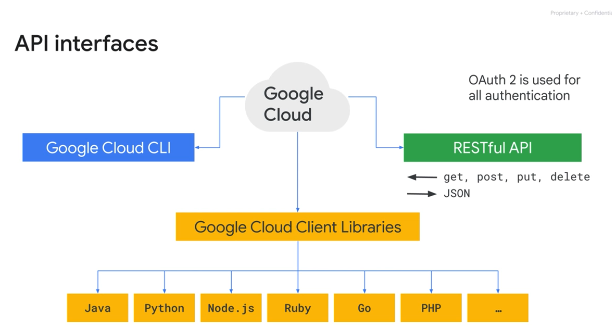

# Ways to Interact with GCP

4 ways:
- Google Cloud console
  - console.cloud.google.com
  - Provides a fast way to perform tasks.
  - Presents options to you, instead of requiring you to know them.
  - Performs behind-the-scenes validation before submitting the commands.
- Cloud Shell and Google Cloud cli
  - A path to automation through scripting `/home/[user]/.profile`
    - source `~/[user]/.profile`
  - Cloud Shell is a __temporary VM with 5GB of persistent memory__( ($HOME dir))
    - Note: __After 1 hour of inactivity, the Cloud Shell instance is recycled__. __Only the /home directory persists__. Any changes made to the system configuration, including environment variables, are lost between sessions.
  - has the google cloud cli (and other tools) preinstalled. Examples:
    - gcloud: for working with Compute Engine and many Google Cloud services
    - gcloud storage: for working with Cloud Storage
    - kubectl: for working with Google Kubernetes Engine and Kubernetes
    - bq: for working with BigQuery
  - Language support for Java, Go, Python, Node.js, PHP, and Ruby
  - Web preview functionality
  - Built-in authorization for access to resources and instances
- REST-based API
- Cloud Mobile Appp

# IaaS & PaaS & Serverless & SaaS

__In the IaaS model, customers pay for the resources they allocate ahead of time; in the PaaS model, customers pay for the resources they actually use.__

## IaaS - Infrastructure as a Service

Delivers on-demand infrastructure resources via the cloud, such as: raw compute, storage, and network capabilities, __organized virtually into resources that are similar to physical data centers__. 

### example 

Compute Engine

## PaaS - Platform as a Service

Offers __bind code to libraries that provide access to the infrastructure application needs__. This allows more resources to be focused on application logic.

### example 

App Engine

## Serverless

__Eliminates the need for any infrastructure management__. 

### example

- Cloud Functions, which manages event-driven code as a pay-as-you-go service
- Cloud Run, which allows customers to deploy their containerized microservices based application in a fully-managed environment. 

## Saas - : Software as a Service 

While it’s outside the scope of this course, you might have heard about software as a service, SaaS, and wondered what it is and how it fits into the Cloud ecosphere. 

__SaaS provides the entire application stack, delivering an entire cloud-based application that customers can access and use__. Software as a Service applications are not installed on your local computer. Instead, they run in the cloud as a service and are __consumed directly over the internet by end users__ 

Popular Google applications such as __Gmail, Docs, and Drive, that are a part of Google Workspace, are all examples of SaaS__.
