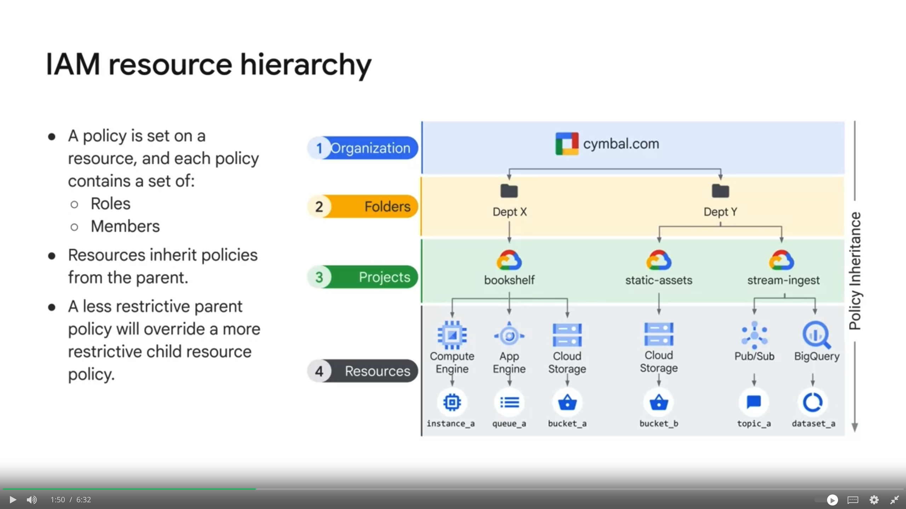

# Resource Hierarchy

Note:
- resources
  - __Each resource has exactly one parent__. For example, a resource can not belong to more than one project. 
- project
  - ID, name, number
  - __Project represents a trust boundary__ in your company. Services in the same project has a default level of trust.
- folder
  - __Q: Can you have only folders without an organization node?__ A: NO!! A folder MUST belong to a Organization node!!
- The IAM policy hierarchy always follows the same path as the Google Cloud resource hierarchy, meaning, __if you change the resource hierarchy, the policy hierarchy also changes__. For example, moving a project into a different organization will update the project's IAM policy to inherit from the new organization's IAM policy.
- __child policies cannot restrict access granted at the parent level__. For example, if someone grants you the Editor role for Department X and someone grants you the Viewer role at the bookshelf project level, then you still have the Editor role for that project. 
- __Deny policies take precedence over access policies__. They provide more granular control. Deny policies were recently introduced so you can define deny rules that prevent certain principals from using certain permissions, regardless of the roles they're granted. 
  - Each project, folder, and organization can have __up to 5 deny policies__ attached to it.

Note: Usually, policies can not be applied to resources level, i.e. only some Google Clound services allow policies to be applied to individual resources.

## Q: Which tool should I turn to if I want to list/create/update/delete projects in my google account?

A: Google Cloud's Resource Manager tool. Which:
- provides __programmatic__ access to GCP through RPC(Remote Procedure Call) API and REST API
- It can even recover projects that were previously deleted

# Predefined roles

## BQ predefined roles

__BigQuery Admin__
This role has __full control__ over all BQ resources, including the ability to create, delete, and update datasets, tables, and views.

__BigQuery Data Viwer__
This role allows users to view data in BQ resources, such as datasets, tables, and views. __Users with this role can also run queries and export data.__

__BigQuery Data Editor__
This role includes all the permissions of the BigQuery Data Viewer role, as well as the ability to create, update, and delete tables and views.

__BigQuery User__
The BigQuery User role allows users to interact with BQ resources, such as running queries, viewing data, and exporting data. 
1) However, the BigQuery User role does not have permissions to create or modify datasets, tables, or views.
2) 2) viewing data, exporting data, creating and updating tables and views, __and managing access control for BQ resources__.

 The BigQueryUserRole provides a broader set of permissions compared to the BigQueryJobUserRole.

__BigQuery Job User__
This role allows users to submit queries and run jobs in BQ, but __they cannot create or modify datasets, tables, or views__.

They can't view the data in preview?

__BigQuery Metadata Viewer__
This role allows users to view metadata about BQ resources, such as dataset and table schemas, but they cannot view the actual data.

__BigQuery Data Owner__
This role includes all the permissions of the BigQuery Admin role, as well as the ability to manage access control for BQ resources.

___There are more__
...

__Q&A__
User vs job User

Admin vs Owner