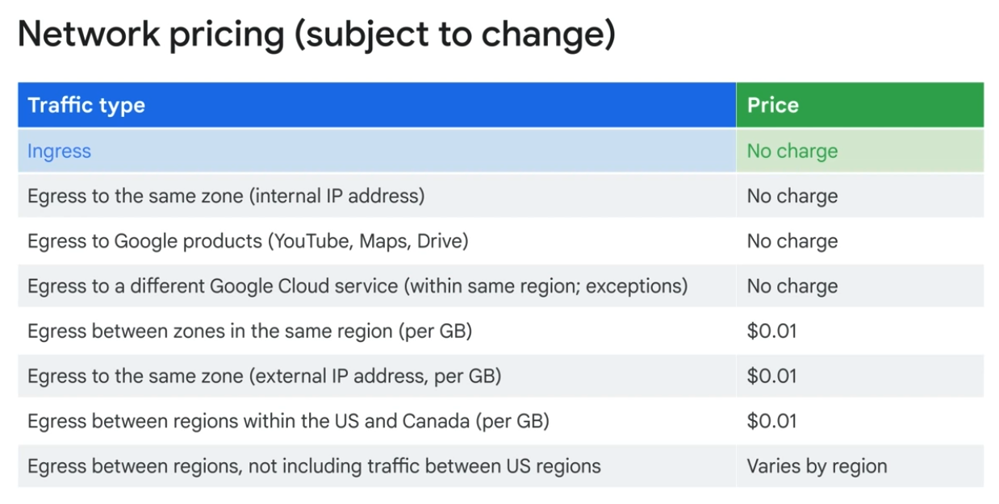
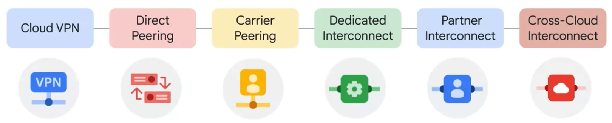
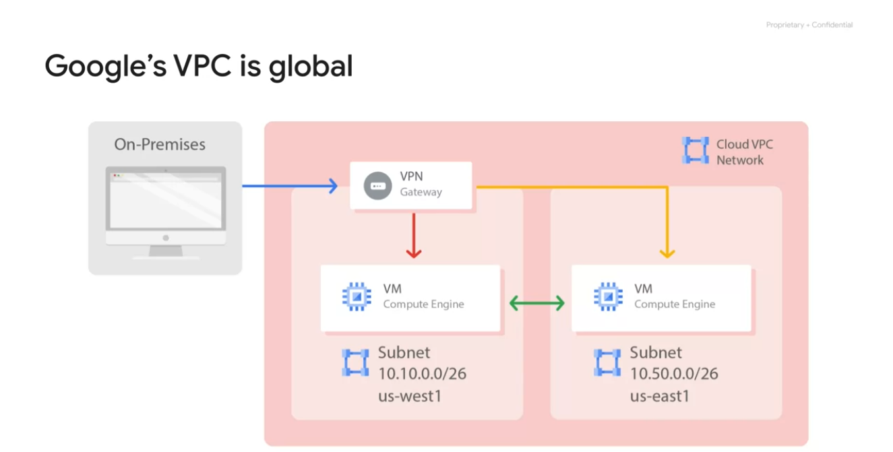
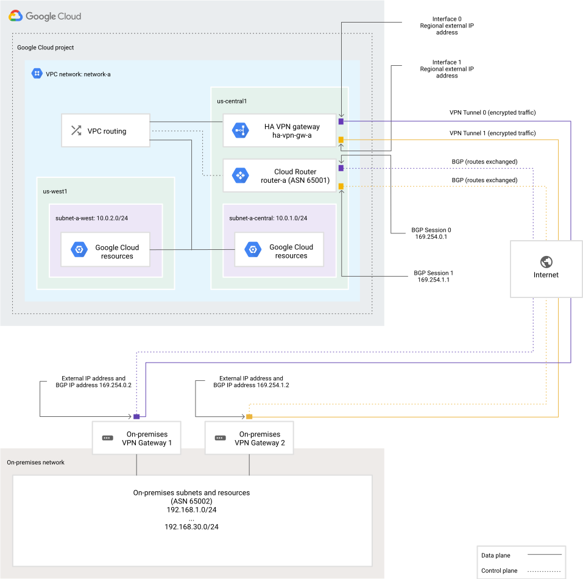

- [Regions, PoPs, and Networks](#regions-pops-and-networks)
- [VPC - Virtual Private Connection](#vpc---virtual-private-connection)
  - [auto mode network/vpc](#auto-mode-networkvpc)
  - [custom mode network/vpc](#custom-mode-networkvpc)
  - [Connectivity within\&between VPC](#connectivity-withinbetween-vpc)
  - [Subnets](#subnets)
    - [reserved IPs in it's private IP range](#reserved-ips-in-its-private-ip-range)
    - [Expand subnets IPs CIDR range](#expand-subnets-ips-cidr-range)
- [IP](#ip)
  - [Internal IP](#internal-ip)
  - [External IP (Optional)](#external-ip-optional)
  - [DNS](#dns)
  - [IP addresses of Default domains](#ip-addresses-of-default-domains)
  - [Firewall](#firewall)
  - [Network Pricing](#network-pricing)
- [Connections between multiple gcp VPCs](#connections-between-multiple-gcp-vpcs)
- [Connecting networks to Google VPC from on premises](#connecting-networks-to-google-vpc-from-on-premises)
  - [1 - Cloud VPN](#1---cloud-vpn)
  - [2 - Direct Peering](#2---direct-peering)
  - [3 - Carrier Peering](#3---carrier-peering)
  - [4 - Dedicated Interconnect](#4---dedicated-interconnect)
  - [5 - Partner Interconnect](#5---partner-interconnect)
  - [6 - Cross-Cloud Interconnect](#6---cross-cloud-interconnect)
- [Routes](#routes)
- [Private Google Access (PGA)](#private-google-access-pga)
- [network related iam role](#network-related-iam-role)

# Regions, PoPs, and Networks

# VPC - Virtual Private Connection

VPC does not have CIDR, only subnets have.

GCP's subnets are regional, while aws's subnets are zonal.

## auto mode network/vpc
 In an auto mode network, __one subnet from each region is automatically__ created within it. 
 
 The __default network is actually an auto__ mode network. 
 
 These automatically created subnets use a set of predefined IP ranges with a __/20 mask that can be expanded to /16__. All of these subnets fit within the __10.128.0.0/9 CIDR block__. 

## custom mode network/vpc

custom mode networks can not be converted to automode.

## Connectivity within&between VPC

On one hand, two VMs, even if they are deployed to different regions, as long as they live in the same VPC, they can communicate using their private IP addresses. 

On the other hand, two VMs, even if they are deployed to the same region, as long as they live in different VPCs, they __have to communicate using their public IP addresses__(unless there are other machagnism set up, such as vpc peering). 
- Note: the traffic between these two VMs __is not touching public internet, but is going through the Google Edge routers__. 

## Subnets

### reserved IPs in it's private IP range

__The first and second addresses__ in the range, .0 and .1 (xxx.xxx.xxx.0, and xxx.xxx.xxx.1), are __reserved for the network and the subnet’s gateway__, respectively.
- For example for a subnet of CIDR 10.0.0.0/24, 10.0.0.0, and 10.0.0.1 would be reserved for the network and the subnet's gateway.

The other reserved addresses in every subnet are the __second-to-last address in the range and the last address, which is reserved as the "broadcast" address__. 

### Expand subnets IPs CIDR range

Expand => ok; make subnet range smaller => Can't

you __can convert the auto mode subnetwork to a custom mode__ subnetwork to increase the IP range further. Specifically, auto mode subnets start with a /20 IP range. They can be expanded to a /16 IP range, __but no larger__. 

___downside of too large subnets___
more likely to cause CIDR range collisions when using Multiple Network Interfaces and VPC Network Peering, or when configuring a VPN or other connections to an on-premises network.

___downtime of network expansion___
Speaking of IP addresses of a subnet, __Google Cloud VPCs let you increase the IP address space of any subnets without any workload shutdown or downtime__. 

# IP

For ephemeral internal or external IPs in GCP, on terminating or deleting-recreating the VMs, the IPs will get released. 
On __stop and restarting__ the VMs, the internal IP should not get released. __But the external IPs will__.

## Internal IP

- Allocated from subnet range to VMs by _DHCP_
- DHCP lease if renewed every 24 hours
- VM name IP is registered with network-scoped DNS
- A ___private RFC 1918 CIDR___ refers to a range of IP addresses defined in RFC 1918, which are reserved for private networks and cannot be directly routed on the public internet; these ranges include: __10.0.0.0/8, 172.16.0.0/12, and 192.168.0.0/16__.

## External IP (Optional)
- Every external IP address assigned in GCP is __unique across the entire internet__ (not just within a specific region or project). Once assigned, no other GCP user or project can have that same IP unless it is released.

- two types: 1) assigned from pool (ephemeral); or 2) reserved (static)
  - if you reserved and __do not assign it to a resource__, such as a VM instance or a forwarding rule, you are __charged at a higher rate__ than for static and ephemeral IP addresses __that are in use__.
- bring your own ip address (BYOIP)
  - You can use your own publicly routable IP address prefixes as Google Cloud external IP addresses and advertise them on the Internet. In order to be eligible, you must own and bring a /24 block or large
- VM does not know its external IP; The exteranl IPs are mapped to the internal IP by VPC.
  - `sudo /sbin/ifconfig` will only return the internal IP of a machine, no external IP is returned.

___External IPs are regional resources___

In Google Cloud Platform (GCP), the statement "External IPs are regional resources" means that external IP addresses (public IPs) are tied to a specific region rather than a specific zone. Here’s what that implies:

Region-level Scope:
- When you allocate an external IP, it belongs to a region rather than a specific availability zone within that region.
- This allows __resources in different zones within the same region to use the external IP__.

Impacts on Redundancy & Failover:
- Since external IPs are regional, they can be reassigned to instances in different zones within the same region.
- __This is useful for high availability setups, where you might need to move an IP from a failed instance in one zone to a backup in another zone__.

Usage with Load Balancers:
- Global external IPs exist, but those are typically used for HTTP(S) Load Balancers.
- For regional services like TCP/UDP load balancers or VM instances with external IPs, the IP is constrained to a specific region.

## DNS

___ZONAL & GLOABAL DNS___

Google Cloud has two types of internal DNS names, Zonal and Global (project wide) DNS. In general, Google __strongly recommends using zonal DNS__ because it offers higher reliability guarantees by isolating failures in the DNS registration to individual zones. 

___HOSTNAME; FQDN; METADATA SERVER___

Each instance has __a hostname that can be resolved to an internal IP addr__:
- the __hostname is the same as the instance name__.
- FQDN (Fully Qualified Domain Names) is [hostname].[zone].c.[project-id].internal
  - example: my-server.us-central1-a.c.guestbook-151617.internal

Each __instance has a metadata server that also acts as a DNS resolver for that instance__. The metadata server handles all DNS queries for local network resources and routes all other queries to Google's public DNS servers for public name resolution.

___PUBLISH___
Public DNS records pointing to instances are not published automatically; however, admins can publish these using existing DNS servers.

___GCP SERVICE: CLOUD DNS___
100% uptime SLA
Global

___Alias IP Ranges___
Alias IP Ranges let you assign a range of internal IP addresses as an alias to a virtual machine's network interface. This is useful if you have multiple services running on a VM, and you want to assign a different IP address to each service. 

how to? => You just draw the alias IP range from the local subnet's primary or secondary CIDR ranges.

example:

## IP addresses of Default domains
Google publishes the complete list of IP ranges that it announces to the internet in goog.json.
Google also publishes a list of GoogleCloud customer-usable global and regional external IP
 addresses ranges in cloud.json.
The following files replace the _spf.google.com TXT records previously recommended to use for
listing Google IP addresses.
- https://www.gstatic.com/ipranges/cloud.jsonprovidesaJSONrepresentationofCloud
IPaddressesorganizedbyregion.
- https://www.gstatic.com/ipranges/cloud_geofeedisastandardgeofeed formattedIP
geolocationfilethatwesharewith3rd-partyIPgeoproviderslikeMaxmind,Neustar,and
IP2Location.
- https://www.gstatic.com/ipranges/goog.jsonand
https://www.gstatic.com/ipranges/goog.txtareJSONandTXTformattedfiles
respectivelythatincludeGooglepublicprefixesinCIDRnotation.

For more information as well as an example of how to use this information,refer to
https://cloud.google.com/vpc/docs/configure-private-google-access#ip-addr-defaults

## Firewall

Firewall rules (ingress/egress) are ___stateful___, meaning they automatically allow responses to the requests.

note: price wise, ingress is not charged

ther is always two default firewall rule with lowest proiority which allows all egress and deny all ingress.ß

## Network Pricing

This table, is from the Compute Engine documentation and it lists the price of each traffic type.

Responses to request account as egress and are charged. 

# Connections between multiple gcp VPCs

https://cloud.google.com/vpc/docs/vpc-peering

traffic not going through public internet.

support internal private IP accassability as well as external IP. 
- Q: would external IP access go through public internet in this case?

limitations:
- subnet IP ranges can't overlap across peered vpc networks
- [Internal DNS names(Compute Engine internal DNS) don't resolve in peered networks](https://cloud.google.com/vpc/docs/vpc-peering#no_dns_across_projects)

# Connecting networks to Google VPC from on premises

The following are several effective ways to connect __on-premises neworks__ or __networks in other clouds__ to a google vpc:

__How to choose network connectivity product doc__
[doc - Choosing a Network Connectivity product](https://cloud.google.com/network-connectivity/docs/how-to/choose-product)

## 1 - Cloud VPN

A simple example:

A "tunnel" connection __over the internet__.

Q: If a new subnet is added to an existing Google VPC, would a Cloud VPN automatically get routs to it?
A: Yes. A ___Cloud Router___ enables you to __dynamically__ exchange routes between a Google VPC and peer network by using _Border Gateway Protocol (BGP)_.

Usecases:
-  a tunnel connection over the public internet to connect to a on-premises networks.

Pros:
- simple

Cons:
- security concerns, because it goes over public internet.
- bandwidth reilability.

## 2 - [Direct Peering](https://cloud.google.com/network-connectivity/docs/direct-peering)

When established, Direct Peering provides a direct path from your on-premises network to Google services, __including Google Cloud products that can be exposed through one or more public IP addresses__. Traffic from Google's network to your on-premises network also takes that direct path, including __traffic from VPC networks in your projects__.

Usecases:
- Direct Peering __exists outside of Google Cloud__. Unless you need to access Google Workspace applications, the recommended methods of access to Google Cloud are _Dedicated Interconnect_ or _Partner Interconnect_. Those two are all google cloud products.

Pros:
- secure
- Does not use any Google Cloud resources; configuration is opaque to Google Cloud projects.

Limitations:
- Direct Peering __does not provide direct access__ to VPC network resources that have __only internal IP__ addresses.
- To change the destination IP address ranges for your on-premises network, contact Google.
- __Google does not offer a service level agreement (SLA)__ with Direct Peering.

## 3 - Carrier Peering

Similar to Direct Peering. But Carrier peering gives you direct access from your on-premises network __through a service provider's network__ to Google Workspace and to __Google Cloud products that can be exposed through one or more public IP addresses__.

Cons:
- __Google does not offer a service level agreement (SLA)__ with Carrier Peering.

## 4 - Dedicated Interconnect

Usecases:
- This option allows for __one or more direct, private connections to Google__. 

Pros:
- the __highest uptimes for interconnection__
  - If these connections have topologies that meet Google’s specifications, they can be __covered by an SLA of up to 99.99%__.
  - Also, these connections __can be backed up by a VPN for even greater reliability__. 

## 5 - Partner Interconnect

provides connectivity between an on-premises network and a VPC network __through a supported service provider__.

Usecases:
- a data center is in __a physical location that can't reach a Dedicated Interconnect colocation facility__
- the __data needs don’t warrant an entire 10 GigaBytes per second connection__.
-  to support __mission-critical services__ or applications that __can tolerate some downtime__.

Pros:
- As with Dedicated Interconnect, if these connections have topologies that meet Google’s specifications, they __can be covered by an SLA of up to 99.99%__.

Cons:
- but note that __Google isn’t responsible__ for any aspects of Partner Interconnect provided by the third-party service provider, nor any issues outside of Google's network. 

## 6 - Cross-Cloud Interconnect

Cross-Cloud Interconnect helps you establish __high-bandwidth dedicated connectivity__ between Google Cloud and __another cloud service__ provider. 

Cross-Cloud Interconnect connections are available in two sizes: 10 Gbps or 100 Gbps.

# Routes

Q: How to configure __internet access__ for external IP VMs? How about internal IP VMs?
A: First, a route on 0.0.0.0/0 to IGW for external IP VMs. Same route but to a NAT GW for internal IP VMs. 
Then, the EGRESS firewall that allows it.

Q: How to configure routes within subnet, so that __resources in the same subnet can route traffic to each other__ ? what about between subnets?
A: A route to subnets' CIDR, with next hop as the subnet itself. For between subnets => experiments to find out.

__Route Types__

- System-generated
  - priority 65534 => Google Cloud only uses a default route if a route with a more specific destination does not apply to a packet.
  - route to Internet => (If no more specific route is specified, the defalut route will be used to access Google API. The alternative to keep rounting within Google network rather than the Internet, would be using Private Google Access or Service Connect Endpoint)
  - default subnet routes to have resources in the same subnet can route traffic to each other
- Custom
  - custom static routes
    - pro: quicker & more secure than dynamic routing
    - con: requires more maintenance & can't point to a VLAN attachment
- Peering
  - ___Dynamic Routes___
    - _Cloud Routers_ is doing the dynamic routing
    - destinations always represent IP address ranges outside your VPC network, which are received from a BGP peer router
    - Dynamic routes are used by: Dedicated Interconnect, Partner Interconnect, HA VPN tunnels. Classic VPN tunnels that use dynamic routing Routes 

# Private Google Access (PGA)

PGA does not have effect on VMs with publich IP. Meaning if an instance has a public IP, then, even if the PGA is enabled in the subnet it blelongs to, it will not use (bypassing) the PGA.

private IP VMs does not need NAT gateway to use PGA to access google services.

# network related iam role

