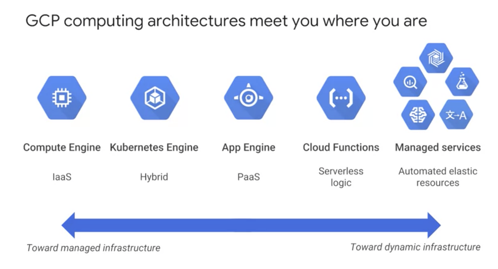
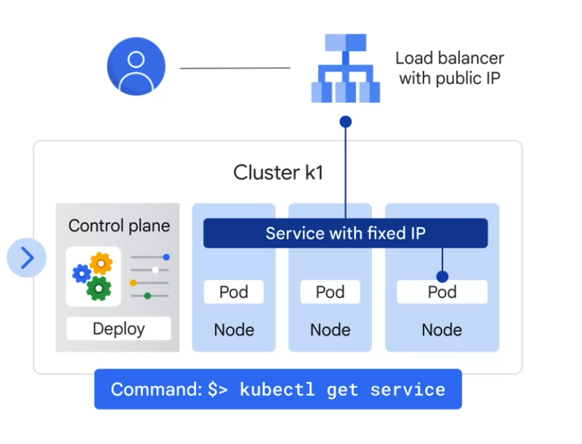

# Compute Engines

## Containers

Infrastructure as a service or IS, allows you to share compute resources with other developers by using Virtual Machines to virtualize the hardware. This lets each developer deploy their own operating system, OS, access the hardware, and build their applications in a self contained environment with access to RAM, file systems, networking interfaces, etc.

The idea of a container is to __give the independent scalability of workloads in pass and an abstraction layer of the OS and hardware in IS__.

A container, is an invisible box around your code and its dependencies with __limited access to its own partition of the file system and hardware__. It only requires a few system calls to create and it starts __as quickly as a process (in seconds)__. 

__All that's needed on each host is an OS kernel that supports containers and a container runtime.__

## K8s
So what is Kubernetes? Kubernetes is an __open source platform for managing containerized workloads and services__. It makes it easy to orchestrate many containers on many hosts, scale them as microservices, and easily deploy, rollouts and rollbacks. 

__At the highest level, Kubernetes is a set of APIs that you can use to deploy containers on a set of "nodes" called a cluster.__ 

__Control Plane__
- The system is divided into a set of primary components that run as the ___control plane___, and a set of ___nodes___ that run containers. 

__Node__
- A k8s node is an actual machine, while a "gcp node" is a vm in Google Compute Engine.
- One k8s node can contain multiple pods. 

__Pod__
- One pod can contain multiple containers. 
- A __pod is the smallest unit__ in K8s that we can creat or deploy.
- A __pod is a running process__ as either a component of the application or the entier application.
- cmds:
  - `kubectl get pods`

__Deployment__
- A deployment represents a group of __replicas__ of the same pod.
- Deployments creat and destroy pods.

__Network__

- The __pod provides a unique network IP and set of ports__ for your containers.
-  A service is an abstraction which defines a logical set of pods and a policy by which to access them.
-  And a controller says, I need to attach an __external load balancer with a public IP address__ to that service so others outside the cluster can access it. In GKE, __the load balancer is created as a network load balancer__. Any client that reaches that IP address will be routed to a pod behind the service.
- As deployments create and destroy pods, pods will be assigned their own IP addresses, but those addresses __don't remain stable__ over time. 
- A ___service group___ is a set of pods and provides a stable endpoint or fixed IP address for them. For example, if you create two sets of pods called frontend and backend, and put them behind their own services, the backend pods might change, but frontend pods are not aware of this. They simply refer to the backend service. 

__K8s Config files__

## GKE

To start up Kubernetes on a cluster in GKE, all you do is run this command: $> gcloud container clusters create k1

## Cloud Run

Cloud Run, a managed compute platform that lets you run stateless containers via web requests or Pub/Sub events. Cloud Run is serverless. That means it removes all infrastructure management tasks so you can focus on developing applications. It is built on Knative, an open API and runtime environment built on Kubernetes that gives you freedom to move your workloads across different environments and platforms. It can be fully managed on Google Cloud, on Google Kubernetes Engine, or anywhere Knative runs. Cloud Run is fast. It can automatically scale up and down from zero almost instantaneously, and it charges you only for the resources you use calculated down to the nearest 100 milliseconds, so you‘ll never pay for your over-provisioned resources.