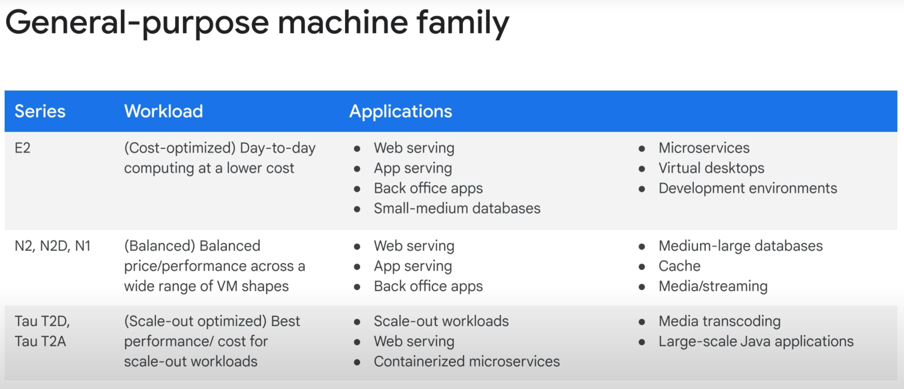
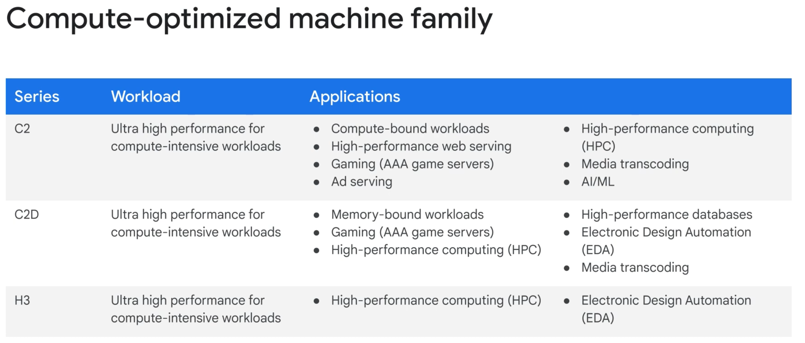
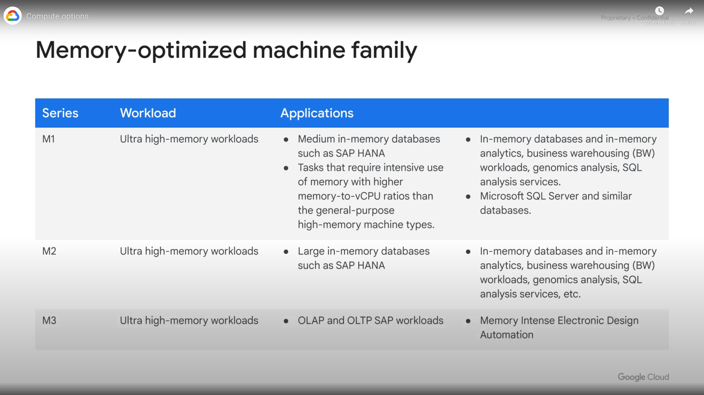
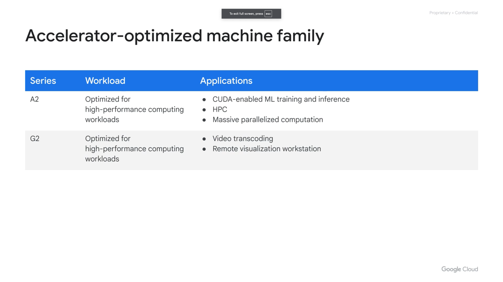

- [VM Instance](#vm-instance)
  - [GCP computing IaaS =\> SaaS](#gcp-computing-iaas--saas)
  - [Basics](#basics)
  - [General-purpose Machine Family](#general-purpose-machine-family)
    - [E2](#e2)
    - [N2, N2D, N1](#n2-n2d-n1)
    - [Tau T2D, Tau T2A](#tau-t2d-tau-t2a)
  - [Compute optimized Machine Family](#compute-optimized-machine-family)
    - [C2](#c2)
    - [C2D](#c2d)
    - [H3](#h3)
  - [Memory-Optimized machine family](#memory-optimized-machine-family)
    - [M1 \& M2](#m1--m2)
    - [M3](#m3)
  - [Accelerator-optimized Machine Family (GPU core)](#accelerator-optimized-machine-family-gpu-core)
    - [A2 (GPU core)](#a2-gpu-core)
    - [G2 (GPU core)](#g2-gpu-core)
  - [vCPU/Core options](#vcpucore-options)
    - [CPU](#cpu)
    - [GPU](#gpu)
    - [TPU](#tpu)
  - [Memory/RAM options](#memoryram-options)
  - [Storage options](#storage-options)
    - [Standard Spinning "Hard Disk Drive (HDD)" vs Flash Memory "Solid-State Drives (SSDs)"](#standard-spinning-hard-disk-drive-hdd-vs-flash-memory-solid-state-drives-ssds)
    - [persistent SSDs vs Local SSD](#persistent-ssds-vs-local-ssd)
    - [Cloud Storage](#cloud-storage)
  - [Life Cycle](#life-cycle)
    - [Stop/Terminate/Restart ...](#stopterminaterestart-)
    - [Host Maintenance Policy](#host-maintenance-policy)
  - [CLIs](#clis)
    - [create new vm](#create-new-vm)
    - [check vm state](#check-vm-state)
    - [after ssh into vm](#after-ssh-into-vm)
  - [Pricing](#pricing)
    - [Preemptible and Spot VMs](#preemptible-and-spot-vms)
    - [Sustained Use Discounts](#sustained-use-discounts)
- [Containers](#containers)
  - [K8s](#k8s)
  - [GKE](#gke)
  - [Cloud Run](#cloud-run)


# VM Instance

## GCP computing IaaS => SaaS

___Compute Engine___ is GCP's service to create VMs. See below for other services:


## Basics

<mark style="background-color: lightgreen;">Q: What is a VM consist of?</mark> 
A: It's consist of:
1. one or more vCPUs (aka "core")
2. memory (aka RAM)
3. disk (aks "storage") w the following options
   1. __Zonal or rigional__ persistent disk - HDD & SSD
   3. [Local SSD](#local-ssd)
   4. [Cloud Storage](#cloud-storage). 
4. IP addresses:
   1. Primary Internal IP: Automatically assigned from the subnet.
   2. Primary External IP: Optional, used for internet access.
   3. Alias IP Ranges: Additional internal IPs for specific applications or services.
   4. Secondary Network Interfaces: Each interface can have its own internal and external IPs.

<mark style="background-color: lightgreen;">Q: What is "burst capacity" of a VM?</mark>
A: It means that the virtual CPU will run above its _rated capacity_ for a __brief period__, using the __available shared physical CPU__.

## General-purpose Machine Family



### E2
__web servers, small to medium databases, development and test environments__, and many applications that don't have strict performance requirements.

cost optimized day-to-day comoyting at a __lower cost__.

The Standard E2 VMs have between __2 to 32 vCPUs with a ratio of 0.5 GB to 8 GB__ of memory per vCPU. 

___SHARED CORE___

- The E2 machine series also contains ___shared-core machine types___ that use context-switching to share a physical core between vCPUs for multitasking. 

- In general, shared-core machine types can be more cost-effective for running small, non-resource intensive applications than standard, high-memory, or high-CPU machine types.

- Shared-core E2 machine types have __0.25 to 1 vCPUs with 0.5 GB to 8 GB of memory__.

### N2, N2D, N1

enterprise applications, medium-to-large databases, and many web and app-serving workloads.

N1 has compatible performance as E2.

The N2 and N2D are the next generation following the N1 VMs, offering a significant performance jump.

N2 VMs support the latest second generation scalable processor from Intel with up to 128 vCPUs and 0.5 to 8 GB of memory per vCPU.

N2D are AMD-based general purpose VMs. They leverage the latest EPYC Milan and EPYC Rome processors, and provide up to 224 vCPUs per node.

### Tau T2D, Tau T2A

scale-out workloads including web servers, containerized microservices, media transcoding, and large-scale Java applications.

T2D VMs are built on the latest 3rd Gen AMD EPYCTM processors and offer full x86 compatibility. T2D VMs come in predefined VM shapes, with up to 60 vCPUs per VM and 4 GB of memory per vCPU.

__Tau T2A machine series is the first machine series in Google Cloud to run on Arm processors__. The Tau T2A machine series runs on a 64 core Ampere Altra processor with an Arm instruction set and an all-core frequency of 3 GHz.

## Compute optimized Machine Family



### C2
4 to 60 vCPUs, up to 240 GB of memory.

attach up to 3 TB of local storage.

### C2D

largest VM sizes

largest available last-level cache per core.

2 to 112 vCPUs, and offer 4 GB of memory per vCPU core.

### H3

The H3 series offer 88 cores and 352 GB of __DDR5 memory__ and are available on the Intel Sapphire Rapids CPU platform and Google's custom Intel Infrastructure Processing Unit (IPU).

__Q: why is h3 not in memory-optimized machine family?__
A: While H3 offers a significant amount of memory (352 GB), it is not comparable to the Memory-Optimized Machine Family (e.g., M1, M2, M3), which provides up to 12 TB of memory for workloads like in-memory databases.

H3 is better suited for workloads requiring high compute performance with moderate memory needs, such as __simulations, scientific computing, or high-performance analytics__.

## Memory-Optimized machine family



These machine series are well-suited for large in-memory databases such as SAP HANA, as well as in-memory data analytics workloads.

### M1 & M2
The M1 machine series has up to 4 TB of memory, while the M2 machine series has up to 12 TB of memory.

Both the M1 and M2 machine series offer the lowest cost per GB of memory on Compute

### M3

up to 128 vCPUs, with up to 30.5 GB of memory per vCPU


## Accelerator-optimized Machine Family (GPU core)



parallelized Compute Unified Device Architecture (CUDA) compute workloads, such as machine learning and high-performance computing.

This family is the optimal choice for workloads that require GPUs.

### A2 (GPU core)

Supports up to 16 NVIDIA Ampere A100 GPUs.(An A100 GPU provides 40 GB of GPU memory—ideal for large language models, databases, and high-performance computing.)

Ideal for machine learning, high-performance computing, and large-scale workloads.

12 to 96 vCPUs, and up to 1360 GB of memory.

### G2 (GPU core)

Supports NVIDIA L4 GPUs.

Optimized for AI inference, graphics-intensive workloads, and video transcoding.

4 to 96 vCPUs, up to 432 GB of memory

## vCPU/Core options

### CPU
__⚠️ : Your choce of CPU will affect your network throughput.__ 
- Specifically, your network will scale at __2 gigabits per second for each CPU core__, EXCEPT for instances with 2 or 4 CPUs which receive up to __10 gigabits per second__ of bandwidth. 
- And there is a theoretical maximum throughput of 200 gigabits per second for an instance with 176 vCPU, when you choose an C3 machine series.

___Hyperthreading___
- Physical cores have hyperthreading. On Compute Engine, __each virtual CPU (or vCPU) is implemented as a single hardware hyper-thread__ on one of the available CPU Platforms.

### GPU

[see section: Accelerator-optimized Machine Family (GPU core)](#accelerator-optimized-machine-family-gpu-core)

### TPU

TPUs are Google’s custom-developed application-specific integrated circuits (ASICs) used to accelerate machine learning workloads.

TPUs act as ___domain-specific hardware___, as opposed to general-purpose hardware with CPUs and GPUs.

This allows for __higher efficiency by tailoring architecture to meet the computation needs in a domain__, such as the matrix multiplication in machine learning.

TPUs are __generally faster__ than current GPUs and CPUs for AI applications and machine learning.

They are also __significantly more energy-efficient__.

__Q: what are the machine family in Google Could that is of TPU core?__
Google Cloud __does not have a specific machine family dedicated to TPU cores__ like it does for GPUs(A2, G2 machine family). Instead, TPUs (Tensor Processing Units) are offered as a __separate accelerator that can be attached to Compute Engine VMs or used in AI/ML services like AI Platform__. TPUs are not categorized under the standard machine families (e.g., General-purpose, Compute-optimized, Memory-optimized, or Accelerator-optimized).

Key Points about TPUs:
- __Standalone TPU Nodes__: TPUs are typically used as standalone nodes for machine learning workloads, especially for TensorFlow and PyTorch.
- __Integration with VMs__: TPUs can be attached to VMs for specific workloads but are not part of a machine family.
- __Use Cases__: TPUs are optimized for deep learning tasks, such as training large neural networks or running inference for AI models.
For TPU usage, you typically configure them separately from the VM machine family.

## Memory/RAM options

In Google Cloud, Memory/RAM options are determined by the machine family and configuration of the virtual machine (VM). Here are the key options:

1. General-Purpose Machine Family
E2, N2, N2D, N1, Tau T2D, Tau T2A:
Memory ranges from 0.5 GB to 8 GB per vCPU.
Suitable for most workloads like web servers, small databases, and development environments.
2. Compute-Optimized Machine Family
C2, C2D, H3:
Memory ranges from 4 GB per vCPU (e.g., C2D) to 352 GB total (e.g., H3).
Designed for compute-intensive workloads with moderate memory needs.
3. Memory-Optimized Machine Family
M1, M2, M3:
Offers the highest memory capacity, up to 12 TB per VM.
Ideal for in-memory databases (e.g., SAP HANA) and large-scale analytics.


## Storage options

### Standard Spinning "Hard Disk Drive (HDD)" vs Flash Memory "Solid-State Drives (SSDs)"

Both of these options provide __the same amount of capacity in terms of disk size__ when choosing a persistent disk.

SSDs are designed to give you a higher number of __IOPS per dollar__ versus standard disks, which will give you a higher amount of __capacity for your dollar__.

Standard and non-local SSD disks can be sized up to 257 TB for each instance.

### persistent SSDs vs Local SSD

However, persistent SSDs (standard or SSD persistent disks) are not physically attached to the VM's host machine. Instead, they are network-attached storage managed by Google Cloud, offering durability and flexibility.

Local SSDs have higher throughput and lower latency than SSD persistent disks, because they are attached to the physical hardware.

However, the data that you store on local SSDs __persists only until you stop or delete the instance__.

Typically, a local SSD is used as a swap disk, just like you would do if you want to create a ramdisk, but if you need more capacity, you can store those on a local SSD.

### Cloud Storage

And this is achieved by one of the following ways
1. Using the Cloud Storage Client Libraries or gsutil: VMs can interact with Cloud Storage buckets programmatically or via command-line tools.
2. __Mounting Cloud Storage as a File System__: Using tools like gcsfuse, you can mount a Cloud Storage bucket to a VM, making it accessible like a local file system.

## Life Cycle


### Stop/Terminate/Restart ...
Q: How to change VM state from running

- Note: the reboot and shutdown are only available in OS
- It’s important to know that if you are rebooting, stopping, or even deleting an instance, the shutdown process will take about 90 sec.
- For a preemptible VM, if the instance does not stop after 30 seconds, Compute Engine sends an ACPI G3 Mechanical Off signal to the operating system. Remember that when writing shutdown scripts for preemptible VMs.

### Host Maintenance Policy
Q: How to configure VM's reaction on host maintenance?
=> [Host maintenance policy overview](https://cloud.google.com/compute/docs/instances/host-maintenance-overview#schedulingoptions)

## CLIs

### create new vm

### check vm state

### after ssh into vm

For the custom VM you just created, click SSH.
To see information about unused and used memory and swap space on your custom VM, run the following command:
```
free
```

To see details about the RAM installed on your VM, run the following command:
```
sudo dmidecode -t 17
```

To verify the number of processors, run the following command:
```
nproc
```

To see details about the CPUs installed on your VM, run the following command:
```
lscpu
```


## Pricing

min 1 minute. Then by seconds.

vCPU and each GB of memory is billed separately rather than as a part of a simgle machine type. You still create instances using predefined machine types, but your bill reports them as individual vCPUs and memory used.

### Preemptible and Spot VMs

Preemptible and Spot VMs are instances that you can create and run at a much lower price than normal instances. 

For both types of VM, Compute Engine might terminate (or preempt) these instances if it requires to access those resources for other tasks.

Importantly, preemptible VMs can only run for up to 24 hours at a time, but Spot VMs do not have a maximum runtime.

### Sustained Use Discounts 

automatic discounts that you get for running specific Compute Engine resources (vCPUs, memory, and GPU devices) __for a significant portion of the billing month__.

For example, when you run one of these resources for more than 25% of a month, Compute Engine automatically gives you a discount for every incremental minute you use for that instance.

The discount increases with usage, and you can get up to 30% net discount for instances that run the entire month.

# Containers

Infrastructure as a service or IS, allows you to share compute resources with other developers by using Virtual Machines to virtualize the hardware. This lets each developer deploy their own operating system, OS, access the hardware, and build their applications in a self contained environment with access to RAM, file systems, networking interfaces, etc.

The idea of a container is to __give the independent scalability of workloads in pass and an abstraction layer of the OS and hardware in IS__.

A container, is an invisible box around your code and its dependencies with __limited access to its own partition of the file system and hardware__. It only requires a few system calls to create and it starts __as quickly as a process (in seconds)__. 

__All that's needed on each host is an OS kernel that supports containers and a container runtime.__

## K8s
So what is Kubernetes? Kubernetes is an __open source platform for managing containerized workloads and services__. It makes it easy to orchestrate many containers on many hosts, scale them as microservices, and easily deploy, rollouts and rollbacks. 

__At the highest level, Kubernetes is a set of APIs that you can use to deploy containers on a set of "nodes" called a cluster.__ 


__Control Plane__
- The system is divided into a set of primary components that run as the ___control plane___, and a set of ___nodes___ that run containers. 

__Node__
- A k8s node is an actual machine, while a "gcp node" is a vm in Google Compute Engine.
- One k8s node can contain multiple pods. 

__Pod__
- One pod can contain multiple containers. 
- A __pod is the smallest unit__ in K8s that we can creat or deploy.
- A __pod is a running process__ as either a component of the application or the entier application.
- cmds:
  - `kubectl get pods`

__Deployment__
- A deployment represents a group of __replicas__ of the same pod.
- Deployments creat and destroy pods.

__Network__


- The __pod provides a unique network IP and set of ports__ for your containers.
-  A service is an abstraction which defines a logical set of pods and a policy by which to access them.
-  And a controller says, I need to attach an __external load balancer with a public IP address__ to that service so others outside the cluster can access it. In GKE, __the load balancer is created as a network load balancer__. Any client that reaches that IP address will be routed to a pod behind the service.
- As deployments create and destroy pods, pods will be assigned their own IP addresses, but those addresses __don't remain stable__ over time. 
- A ___service group___ is a set of pods and provides a stable endpoint or fixed IP address for them. For example, if you create two sets of pods called frontend and backend, and put them behind their own services, the backend pods might change, but frontend pods are not aware of this. They simply refer to the backend service. 


__K8s Config files__


## GKE

To start up Kubernetes on a cluster in GKE, all you do is run this command: $> gcloud container clusters create k1

## Cloud Run

Cloud Run, a managed compute platform that lets you run stateless containers via web requests or Pub/Sub events. Cloud Run is serverless. That means it removes all infrastructure management tasks so you can focus on developing applications. It is built on Knative, an open API and runtime environment built on Kubernetes that gives you freedom to move your workloads across different environments and platforms. It can be fully managed on Google Cloud, on Google Kubernetes Engine, or anywhere Knative runs. Cloud Run is fast. It can automatically scale up and down from zero almost instantaneously, and it charges you only for the resources you use calculated down to the nearest 100 milliseconds, so you‘ll never pay for your over-provisioned resources.