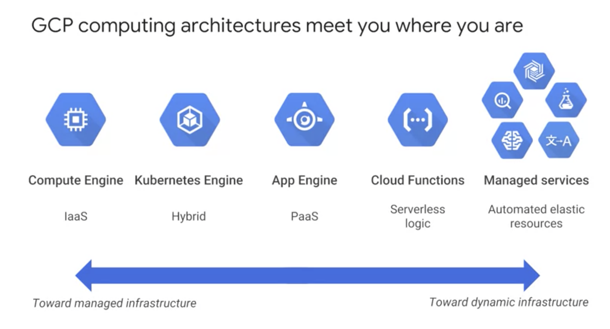
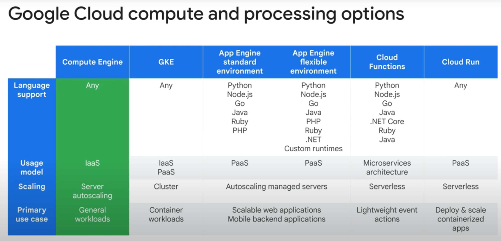
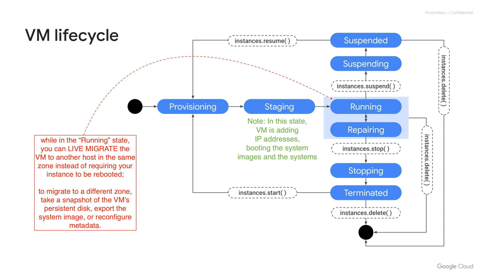
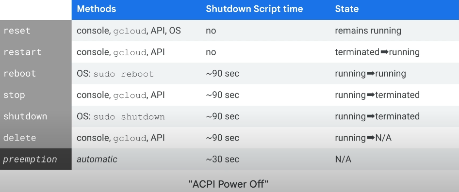

- [VM Instance](#vm-instance)
  - [GCP computing IaaS =\> SaaS](#gcp-computing-iaas--saas)
  - [Basics](#basics)
  - [vCPU/Core options](#vcpucore-options)
    - [CPU](#cpu)
    - [GPU](#gpu)
    - [TPU](#tpu)
  - [Memory/RAM options](#memoryram-options)
  - [Storage options](#storage-options)
    - [Standard Spinning "Hard Disk Drive (HDD)" vs Flash Memory "Solid-State Drives (SSDs)"](#standard-spinning-hard-disk-drive-hdd-vs-flash-memory-solid-state-drives-ssds)
    - [Local SSD](#local-ssd)
    - [Cloud Storage](#cloud-storage)
  - [Life Cycle](#life-cycle)
    - [Stop/Terminate/Restart ...](#stopterminaterestart-)
    - [Host Maintenance Policy](#host-maintenance-policy)
  - [CLIs](#clis)
  - [Pricing](#pricing)
- [Containers](#containers)
  - [K8s](#k8s)
  - [GKE](#gke)
  - [Cloud Run](#cloud-run)

# VM Instance

## GCP computing IaaS => SaaS

___Compute Engine___ is GCP's service to create VMs. See below for other services:

## Basics

<mark style="background-color: lightgreen;">Q: What is a VM consist of?</mark> 
A: It's consist of:
1. one or more vCPUs (aka "core")
2. memory (aka RAM)
3. disk (aks "storage") w the following options
   1. __Zonal or rigional__ persistent disk - HDD & SSD
   3. [Local SSD](#local-ssd)
   4. [Cloud Storage](#cloud-storage). 
4. IP addresses:
   1. Primary Internal IP: Automatically assigned from the subnet.
   2. Primary External IP: Optional, used for internet access.
   3. Alias IP Ranges: Additional internal IPs for specific applications or services.
   4. Secondary Network Interfaces: Each interface can have its own internal and external IPs.

<mark style="background-color: lightgreen;">Q: What is "burst capacity" of a VM?</mark>
A: It means that the virtual CPU will run above its _rated capacity_ for a __brief period__, using the __available shared physical CPU__.

## vCPU/Core options

### CPU
__⚠️ : Your choce of CPU will affect your network throughput.__ 
- Specifically, your network will scale at __2 gigabits per second for each CPU core__, EXCEPT for instances with 2 or 4 CPUs which receive up to __10 gigabits per second__ of bandwidth. 
- And there is a theoretical maximum throughput of 200 gigabits per second for an instance with 176 vCPU, when you choose an C3 machine series.

___Hyperthreading___
- Physical cores have hyperthreading. On Compute Engine, __each virtual CPU (or vCPU) is implemented as a single hardware hyper-thread__ on one of the available CPU Platforms.

### GPU

### TPU

TPUs are Google’s custom-developed application-specific integrated circuits (ASICs) used to accelerate machine learning workloads.

TPUs act as ___domain-specific hardware___, as opposed to general-purpose hardware with CPUs and GPUs.

This allows for __higher efficiency by tailoring architecture to meet the computation needs in a domain__, such as the matrix multiplication in machine learning.

TPUs are __generally faster__ than current GPUs and CPUs for AI applications and machine learning.

They are also __significantly more energy-efficient__.

## Memory/RAM options

## Storage options

### Standard Spinning "Hard Disk Drive (HDD)" vs Flash Memory "Solid-State Drives (SSDs)"

Both of these options provide __the same amount of capacity in terms of disk size__ when choosing a persistent disk.

SSDs are designed to give you a higher number of __IOPS per dollar__ versus standard disks, which will give you a higher amount of __capacity for your dollar__.

Standard and non-local SSD disks can be sized up to 257 TB for each instance.

### Local SSD

Local SSDs have higher throughput and lower latency than SSD persistent disks, because they are attached to the physical hardware.

However, the data that you store on local SSDs __persists only until you stop or delete the instance__.

Typically, a local SSD is used as a swap disk, just like you would do if you want to create a ramdisk, but if you need more capacity, you can store those on a local SSD.

### Cloud Storage

And this is achieved by one of the following ways
1. Using the Cloud Storage Client Libraries or gsutil: VMs can interact with Cloud Storage buckets programmatically or via command-line tools.
2. __Mounting Cloud Storage as a File System__: Using tools like gcsfuse, you can mount a Cloud Storage bucket to a VM, making it accessible like a local file system.

## Life Cycle

### Stop/Terminate/Restart ...
Q: How to change VM state from running

- Note: the reboot and shutdown are only available in OS
- It’s important to know that if you are rebooting, stopping, or even deleting an instance, the shutdown process will take about 90 sec.
- For a preemptible VM, if the instance does not stop after 30 seconds, Compute Engine sends an ACPI G3 Mechanical Off signal to the operating system. Remember that when writing shutdown scripts for preemptible VMs.

### Host Maintenance Policy
Q: How to configure VM's reaction on host maintenance?
=> [Host maintenance policy overview](https://cloud.google.com/compute/docs/instances/host-maintenance-overview#schedulingoptions)

## CLIs

## Pricing

# Containers

Infrastructure as a service or IS, allows you to share compute resources with other developers by using Virtual Machines to virtualize the hardware. This lets each developer deploy their own operating system, OS, access the hardware, and build their applications in a self contained environment with access to RAM, file systems, networking interfaces, etc.

The idea of a container is to __give the independent scalability of workloads in pass and an abstraction layer of the OS and hardware in IS__.

A container, is an invisible box around your code and its dependencies with __limited access to its own partition of the file system and hardware__. It only requires a few system calls to create and it starts __as quickly as a process (in seconds)__. 

__All that's needed on each host is an OS kernel that supports containers and a container runtime.__

## K8s
So what is Kubernetes? Kubernetes is an __open source platform for managing containerized workloads and services__. It makes it easy to orchestrate many containers on many hosts, scale them as microservices, and easily deploy, rollouts and rollbacks. 

__At the highest level, Kubernetes is a set of APIs that you can use to deploy containers on a set of "nodes" called a cluster.__ 

__Control Plane__
- The system is divided into a set of primary components that run as the ___control plane___, and a set of ___nodes___ that run containers. 

__Node__
- A k8s node is an actual machine, while a "gcp node" is a vm in Google Compute Engine.
- One k8s node can contain multiple pods. 

__Pod__
- One pod can contain multiple containers. 
- A __pod is the smallest unit__ in K8s that we can creat or deploy.
- A __pod is a running process__ as either a component of the application or the entier application.
- cmds:
  - `kubectl get pods`

__Deployment__
- A deployment represents a group of __replicas__ of the same pod.
- Deployments creat and destroy pods.

__Network__

- The __pod provides a unique network IP and set of ports__ for your containers.
-  A service is an abstraction which defines a logical set of pods and a policy by which to access them.
-  And a controller says, I need to attach an __external load balancer with a public IP address__ to that service so others outside the cluster can access it. In GKE, __the load balancer is created as a network load balancer__. Any client that reaches that IP address will be routed to a pod behind the service.
- As deployments create and destroy pods, pods will be assigned their own IP addresses, but those addresses __don't remain stable__ over time. 
- A ___service group___ is a set of pods and provides a stable endpoint or fixed IP address for them. For example, if you create two sets of pods called frontend and backend, and put them behind their own services, the backend pods might change, but frontend pods are not aware of this. They simply refer to the backend service. 

__K8s Config files__

## GKE

To start up Kubernetes on a cluster in GKE, all you do is run this command: $> gcloud container clusters create k1

## Cloud Run

Cloud Run, a managed compute platform that lets you run stateless containers via web requests or Pub/Sub events. Cloud Run is serverless. That means it removes all infrastructure management tasks so you can focus on developing applications. It is built on Knative, an open API and runtime environment built on Kubernetes that gives you freedom to move your workloads across different environments and platforms. It can be fully managed on Google Cloud, on Google Kubernetes Engine, or anywhere Knative runs. Cloud Run is fast. It can automatically scale up and down from zero almost instantaneously, and it charges you only for the resources you use calculated down to the nearest 100 milliseconds, so you‘ll never pay for your over-provisioned resources.