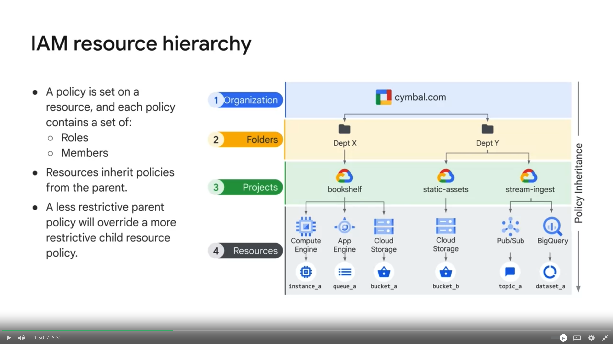

# Resource Hierarchy

Note:
- __Each resource has exactly one parent__. For example, a resource can not belong to more than one project. 
- __Project represents a trust boundary__ in your company. Services in the same project has a default level of trust.
- The IAM policy hierarchy always follows the same path as the Google Cloud resource hierarchy, meaning, __if you change the resource hierarchy, the policy hierarchy also changes__. For example, moving a project into a different organization will update the project's IAM policy to inherit from the new organization's IAM policy.
- __child policies cannot restrict access granted at the parent level__. For example, if someone grants you the Editor role for Department X and someone grants you the Viewer role at the bookshelf project level, then you still have the Editor role for that project. 
- __Deny policies take precedence over access policies__. They provide more granular control. Deny policies were recently introduced so you can define deny rules that prevent certain principals from using certain permissions, regardless of the roles they're granted. 
  - Each project, folder, and organization can have __up to 5 deny policies__ attached to it.

# Predefined roles
